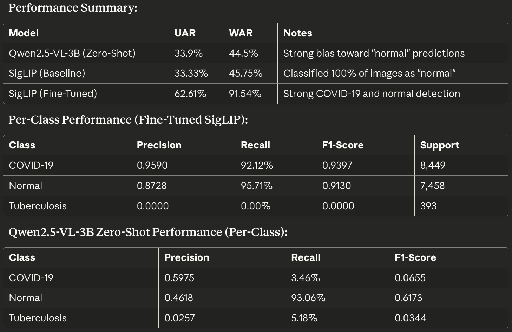
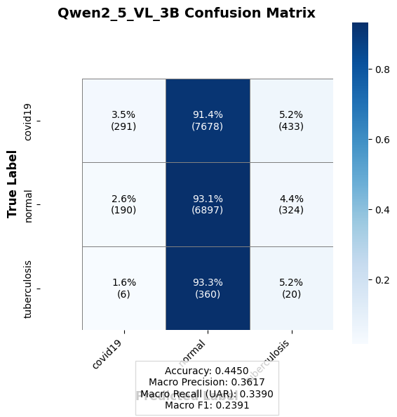
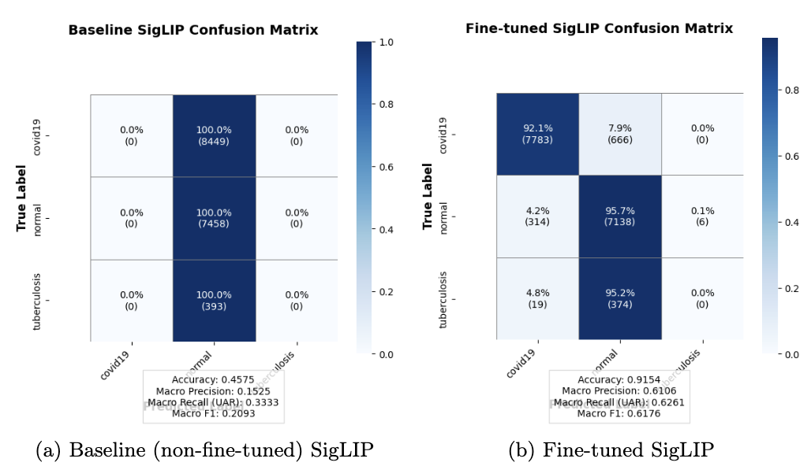

Part 1: Conceptual Design

**Abstract**: Medical imaging plays a critical role in diagnosing respiratory conditions, yet accurate interpretation of chest CT scans and X-rays remains challenging. Visual differences between diseases like COVID-19 and tuberculosis can be subtle, and diagnostic interpretation often varies between radiologists. This project aims to develop an automated multi-class classification system capable of distinguishing between COVID-19, tuberculosis, and normal lung cases from chest imaging data.

**Problem**: The primary challenge in chest imaging classification lies in the subtle visual distinctions between different pathologies. COVID-19 typically presents with bilateral or peripheral ground-glass opacities, consolidation in lower lobes, vascular enlargement, and crazy-paving patterns. Tuberculosis, on the other hand, manifests through upper lobe infiltrates, cavitary lesions, tree-in-bud appearance, fibrosis, and volume loss with often asymmetrical chronic scarring. Normal lungs appear fully aerated with no visible opacities, nodules, fibrosis, cavitation, or signs of infection. These differences, while clinically documented, can be difficult to distinguish visually—especially for automated systems without domain-specific training.

**Solution**: To address this classification problem, I propose a two-pronged approach that evaluates both zero-shot capabilities and fine-tuning potential of state-of-the-art (SOTA) vision-language models. First, I will establish a baseline using Qwen2.5-VL-3B's zero-shot performance to understand how well a powerful multimodal model can classify medical images without task-specific training. Second, I will fine-tune the SigLIP (Sigmoid Loss for Image-Text Pairs) architecture, which employs a Vision Transformer backbone designed for efficient contrastive learning between image and text pairs. The hypothesis is that while foundation models possess general visual understanding, domain-specific fine-tuning remains essential for optimal medical image classification accuracy.
For feature extraction, I will rely on SigLIP's Vision Transformer backbone, which processes image patches through self-attention mechanisms. This generates high-quality image embeddings that capture both fine-grained details (subtle opacities, lesion boundaries) and global context (overall lung structure, bilateral patterns) necessary for distinguishing between visually similar pathologies. The model should learn to focus on diagnostically relevant regions such as lung fields, opacity patterns, and structural abnormalities.
The solution should ideally be agnostic to several factors that vary across medical imaging datasets: scanner manufacturer and model, patient demographics (age, gender), image acquisition parameters, and minor variations in patient positioning. By training on diverse data sources, the classifier should generalize across these variations rather than overfitting to specific imaging conditions.

**Datasets**: I plan to assemble a dataset of approximately 16,300 images across three classes from publicly available medical imaging repositories:

- **COVID CT Slices Dataset**: Provides approximately 14,486 PNG-format images (7,593 COVID-positive and 6,893 normal cases). This dataset offers a large volume of labeled COVID-19 cases for training.
- **MosMedData Chest CT Scans**: Contains 3D volumetric CT scans in NIfTI format with COVID-19 related findings. I will extract center slices from the axial plane, yielding approximately 1,110 2D PNG images. Center slice extraction is chosen because this view typically contains the most comprehensive representation of lung pathology.
- **Chest X-ray Dataset for Tuberculosis**: Provides 704 PNG-format images with tuberculosis positive and negative labels. This dataset addresses the tuberculosis class, though its smaller size presents a class imbalance challenge.

All images will be standardized to 224×224 pixels to meet model input requirements. The data will be split using an 80/10/10 ratio for training, validation, and testing. The training set will be used to optimize model parameters, the validation set will monitor generalization and prevent overfitting, and the test set will remain untouched until final evaluation to provide an unbiased assessment of model performance.
Anticipated Challenges: The significant class imbalance (tuberculosis: ~700 images vs. COVID-19: ~8,400 images) will likely require weighted sampling or other balancing techniques during training. Additionally, the datasets originate from different sources with varying image characteristics, which may introduce domain shift issues that the model must learn to handle.

**Next Steps**: After data acquisition, I will implement preprocessing pipelines to standardize images across sources, evaluate zero-shot baselines, and then proceed with fine-tuning experiments to optimize classification performance.

**Part 2: Data Acquisition and Preparation**
**Overview**
I have assembled a multi-source dataset comprising approximately 16,300 chest imaging samples across three diagnostic classes: COVID-19, tuberculosis, and normal lung cases. The data has been acquired from three publicly available medical imaging repositories, each contributing unique characteristics to the overall dataset.

Dataset Sources are: 
**1. Large COVID-19 CT Scan Slice Dataset**

Source Link: [https://github.com/UCSD-AI4H/COVID-CT](https://www.kaggle.com/datasets/maedemaftouni/large-covid19-ct-slice-dataset)
This one kaggle open-source covid-19 ct dataset contributes 14,486 PNG-format CT slice images, consisting of 7,593 COVID-positive cases and 6,893 normal cases. The original dataset also includes Community-Acquired Pneumonia (CAP) cases (2,618 images), but these were excluded to maintain a clean three-class classification problem focused on COVID-19, tuberculosis, and normal cases.
Sample Characteristics: Images are 2D CT slices in PNG format, capturing axial views of the chest cavity with varying resolutions standardized to 224×224 pixels for model input.

**2. MosMedData Chest CT Scans with COVID-19**

Source Link: [https://mosmed.ai/en/](https://www.kaggle.com/datasets/mathurinache/mosmeddata-chest-ct-scans-with-covid19) 
This is another kaggle open-source dataset originally contains 3D volumetric CT scans in NIfTI format. I extracted center slices along the axial plane from each volumetric scan, yielding 1,110 2D PNG images. The center slice was chosen because it typically provides the most comprehensive view of lung pathology, capturing bilateral lung fields and any central consolidations or opacities.
Preprocessing Applied: For each 3D scan, I applied min-max normalization to ensure consistent contrast and brightness, mapping pixel values to the standard 8-bit range (0-255). The normalized slices were then converted to RGB format for compatibility with pre-trained vision models.

**3. Chest X-ray Dataset for Tuberculosis Segmentation**

Source Link: [https://www.kaggle.com/datasets/raddar/tuberculosis-chest-xrays-shenzhen](https://www.kaggle.com/datasets/iamtapendu/chest-x-ray-lungs-segmentation)
This is the third kaggle open-source dataset, which provides 704 PNG-format chest X-ray images with corresponding labels for tuberculosis positive (PTB=1) and tuberculosis negative (PTB=0) cases. The original dataset includes segmentation masks, but these were excluded from the current study because other datasets lack corresponding masks, and the classification approach does not require explicit region annotations.
Sample Characteristics: Frontal chest X-ray images captured using standard radiographic equipment, standardized to 224×224 pixels.

**Dataset Summary**
Class (Number of Samples Percentage): COVID-19: 8449 - 51.8%; Normal: 7458 - 45.7%; Tuberculosis: 393 - 2.4% with a total of 16,300 samples. 
Data Split
The dataset is partitioned using an 80/10/10 ratio:
Training size: ~13,040 samples; Validation size: ~1,630 samples; and Testsize: ~1,630 samples. 

**Training Set**: Used to optimize model weights through backpropagation. The model sees these samples repeatedly across epochs and learns to extract discriminative features for each class. Due to class imbalance, weighted sampling is applied during training, assigning weights inversely proportional to class frequencies to ensure the model receives adequate exposure to underrepresented classes (particularly tuberculosis).
**Validation Set**: Used to evaluate model performance on unseen data after each training epoch. This subset helps detect overfitting—if training accuracy continues improving while validation accuracy plateaus or decreases, it signals that the model is memorizing training samples rather than learning generalizable patterns. No weighted sampling is applied during validation to obtain realistic performance estimates.
**Key Consideration**: Given the severe class imbalance (tuberculosis represents only 2.4% of total samples), the validation set may contain very few tuberculosis cases (~39 samples). This limited representation makes validation metrics for the tuberculosis class less stable and potentially unreliable as a performance indicator.

**Sample Characteristics**
PropertyDescriptionResolutionAll images standardized to 224×224 pixelsFormatPNG (8-bit RGB)Imaging ModalitiesCT scans (COVID-19, some normal) and X-rays (tuberculosis, some normal)Anatomical ViewAxial CT slices and frontal chest X-raysContrast/BrightnessMin-max normalized to 0-255 range

**Class Imbalance Consideration**
The dataset exhibits significant class imbalance, with tuberculosis severely underrepresented compared to COVID-19 and normal cases. To address this during training, I implemented weighted sampling where each class receives a sampling weight inversely proportional to its frequency. This ensures the model encounters tuberculosis samples more frequently relative to their actual proportion in the dataset, helping prevent the classifier from simply predicting the majority class.

<b></b>Examples in these datasets:

<table id="tfhover" class="tftable" border="1">
<tr><td width="30%"><image src="samples-gif/sample_covid_1.png" /></td><td width="15%"><b>Covid 19 Case</b></td><td>This is one example case that shows the patient present Covid 19 disease in CT Scan </td></tr>
<tr><td width="30%"><image src="samples-gif/sample_covid_2.png" /></td><td width="15%"><b>Covid 19 Case</b></td><td>This is another example case that shows the patient presents Covid 19 disease in CT Scan </td></tr>
<tr><td width="30%"><image src="samples-gif/sample_healthy_1.png" /></td><td width="15%"><b>Normal Case</b></td><td>This is one example case that shows the patient does not present any Covid 19 disease in CT Scan or you can interpret as a healthy/normal lung. </td></tr>
<tr><td width="30%"><image src="samples-gif/sample_healthy_2.png" /></td><td width="15%"><b>Normal Case</b></td><td>This is another example case that shows the patient does not present any Covid 19 disease in CT Scan or you can interpret as a healthy/normal lung. </td></tr>
<tr><td width="30%"><image src="samples-gif/sample_tuber_1.png" /></td><td width="15%"><b>Tuberculosis 19 Case</b></td><td>This is one example case that shows the patient presents Tuberculosis symptom in X-ray format. </td></tr></table>

You can expect the Large Multimodal Models to take in both **CT Scan** and **X-ray** format images for diagnosis with clear note on the type of input images. 

### Part 3: First Update
**3.1 Methods Applied for Data Preprocessing and Feature Extraction**

**Data Preprocessing**:
- For the MosMedData collection, I extracted the center slice along the axial plane from each 3D volumetric CT scan (NIfTI format). The center slice was selected because it typically contains the most comprehensive view of the lungs, capturing bilateral lung fields and central pathology.
- Intensity Normalization: Applied min-max normalization to ensure consistent contrast and brightness across all images, mapping pixel values to the standard 8-bit range (0-255). This standardization is essential when combining images from different scanners and acquisition protocols.
- Color Space Conversion: Converted all grayscale medical images to RGB format (3-channel) for compatibility with pre-trained vision models, which expect RGB input.
- Spatial Standardization: Resized all images to 224×224 pixels to meet the input requirements of both Qwen2.5-VL-3B and SigLIP models.
- Dataset Fusion: Combined images from all three source datasets (COVID CT Slices, MosMedData, TB X-rays) while maintaining their original class labels (COVID-19, tuberculosis, or normal).

**Feature Extraction Methods**:
- Qwen2.5-VL-3B Zero-Shot Inference: Used this 3-billion parameter multimodal vision-language model to establish a zero-shot baseline. The model integrates advanced vision encoding with large language model capabilities, allowing it to interpret medical images using structured text prompts without task-specific training.
- SigLIP Vision Transformer: Employed SigLIP (Sigmoid Loss for Image-Text Pairs) architecture with a Vision Transformer (ViT) backbone for feature extraction. The ViT processes images by: (1). Dividing the 224×224 input image into fixed-size patches (16×16 pixels). (2). Linearly embedding each patch into a vector representation. (3). Processing patch embeddings through multiple self-attention layers. (4). Generating a final image embedding that captures both local details and global context

- Classification Head: Replaced SigLIP's original text encoder with a classification layer that maps the extracted image embeddings to three output classes (COVID-19, tuberculosis, normal).

**3.2 Justification for Algorithm Choices**
- Why Min-Max Normalization? Medical imaging data from different sources exhibits varying intensity distributions due to differences in scanner hardware, acquisition parameters, and reconstruction algorithms. Min-max normalization maps all pixel values to a consistent [0, 255] range, ensuring that the model receives standardized input regardless of the original intensity distribution. This prevents the model from learning source-specific intensity patterns rather than diagnostically relevant features.
- Why Center Slice Extraction from 3D Volumes? For the MosMedData 3D CT scans, processing entire volumes would be computationally prohibitive and would require 3D architectures. Center slice extraction offers a practical compromise: the middle axial slice typically captures both lungs in their fullest extent; it often contains the most representative view of diffuse pathologies like COVID-19 ground-glass opacities; and it enables use of efficient 2D vision models pre-trained on natural images
- Why RGB Conversion? Although medical images are inherently grayscale, state-of-the-art vision models (including SigLIP and Qwen2.5-VL) are pre-trained on RGB natural images. Converting grayscale to RGB (by replicating the single channel three times) allows these models to apply their learned feature representations to medical images without architectural modifications.
- Why SigLIP Architecture? SigLIP was selected because it uses sigmoid loss instead of softmax-based contrastive loss, enabling more efficient batch processing and better scaling properties. Also its has strong Vision Transformer Backbone: The ViT architecture processes images through self-attention mechanisms, allowing the model to capture: (1). Fine-grained details (subtle opacities, lesion boundaries, cavitary margins). (2). Global context (overall lung structure, bilateral patterns, anatomical relationships). (3). Long-range dependencies between distant image regions.
It also has transfer learning potential - pre-trained on large-scale image-text pairs, SigLIP has learned robust visual representations that can be adapted to medical imaging through fine-tuning.
Computational Efficiency: The SigLIP-Base model (86M parameters) is substantially smaller than Qwen2.5-VL-3B (3B parameters), enabling faster training and inference on limited GPU resources (single A-100 40GB).

- Why Qwen2.5-VL-3B for Zero-Shot Baseline? Qwen2.5-VL-3B represents a state-of-the-art multimodal model with strong general visual understanding. Evaluating its zero-shot performance serves two purposes: (1). establishes how well foundation models can perform on specialized medical tasks without domain adaptation, and (2). it provides a meaningful baseline to quantify the value added by task-specific fine-tuning

**3.3 Illustrations of Preprocessing Results**
Below are examples demonstrating how the preprocessing pipeline transforms raw medical images into standardized model inputs.
-  For the covid 19 example 1, we can expect the following annotation: "This is a COVID-19 positive case showing bilateral ground-glass opacities. Image standardized to 224×224 pixels with normalized intensity."
-  For the non-covid 19/healthy lung example 1, we can expect the following annotation: "This is a normal lung CT showing fully aerated lungs with no visible opacities or abnormalities."
-  For the tuberculosis example 1, we can expect the following annotation: "This is a tuberculosis case showing characteristic upper lobe infiltrates visible on frontal chest X-ray."

**3.4 Instructions for Running the Code**
You can run the following instructions step by step to set up first. 
1. Clone the Repo:
- git clone https://github.com/nx3782/LMM-Performance-on-Medical-Field.git
  cd LMM-Performance-on-Medical-Field

2. Run zero-shot inference with Qwen2.5-VL-3B:
- python baseline_qwen.py --image_path ./samples-gif/covid_1.png

3. Run inference with SigLIP (baseline or fine-tuned):
- python inference.py --image_path ./samples-gif/covid_1.png --model_type baseline
  python inference.py --image_path ./samples-gif/covid_1.png --model_type finetuned
You can expect outputs similar to the following: Input: covid_1.png; Predicted Class: covid19

**Part 4: Final Solution**
**4.1 Justification of Classifier Choice**: 
After completing preprocessing and feature extraction, I evaluated three classification approaches: zero-shot inference with Qwen2.5-VL-3B, baseline SigLIP, and fine-tuned SigLIP. The final classifier is the fine-tuned SigLIP model, selected for the following reasons:Why SigLIP for Classification?
Architecture Design for Image Classification: SigLIP is specifically designed to handle image-text contrastive learning tasks. By replacing the text encoder with a classification head, we obtain a powerful image classifier that leverages the pre-trained Vision Transformer's ability to extract discriminative features.

**Vision Transformer Backbone**: SigLIP employs a ViT backbone that processes image patches through self-attention mechanisms. This architecture excels at capturing: 
Local features (subtle opacities, lesion boundaries)
Global context (overall lung structure, bilateral patterns)
Long-range dependencies between distant image regions

**Transfer Learning Efficiency**: Pre-trained on large-scale image-text pairs, SigLIP has learned robust visual representations. Fine-tuning adapts these representations to the medical imaging domain while preserving general visual understanding capabilities.

**Computational Practicality**: With approximately 86 million parameters, SigLIP is substantially smaller than Qwen2.5-VL-3B (3 billion parameters). This enabled efficient fine-tuning on a single A-100 40GB GPU within reasonable time and memory constraints.
Why Not Qwen2.5-VL-3B? 
While Qwen2.5-VL-3B is a powerful multimodal model, several factors made it less suitable as the primary classifier:
- Zero-shot performance was limited (33.9% UAR), indicating insufficient domain-specific knowledge
- Fine-tuning a 3B parameter model would require substantially more computational resources
- The model showed strong bias toward predicting "normal" for most inputs

Why Not Traditional CNN Architectures?
- My original plan included comparing multiple CNN architectures (ResNet, EfficientNet). However, package dependency conflicts in Google Colab and GPU resource limitations necessitated focusing on transformer-based approaches. SigLIP's ViT backbone ultimately provided strong performance without requiring CNN-specific implementations.

Fine-Tuning Strategy:
- Optimizer: AdamW with learning rate 2e-5 and weight decay 0.01
- Learning Rate Schedule: Cosine scheduler with 500 warmup steps
- Batch Size: 32
- Epochs: 10
- Loss Function: Cross-entropy loss

**4.2 Classification Accuracy**
I evaluated model performance using Unweighted Average Recall (UAR) and Weighted Average Recall (WAR) to account for class imbalances. UAR treats all classes equally regardless of sample size, while WAR weights by class frequency.

**4.3 Commentary on Observed Accuracy and Ideas for Improvement**
**Key Observations**:
**Dramatic Improvement from Fine-Tuning**: The fine-tuned SigLIP model (62.61% UAR) nearly doubled the performance of both zero-shot baselines (~33% UAR). This confirms the hypothesis that domain-specific fine-tuning is essential for medical image classification, even when using powerful foundation models.

**Strong Performance on Majority Classes**: The fine-tuned model achieved excellent results for COVID-19 (92.12% recall) and normal (95.71% recall) cases. This indicates that the model successfully learned discriminative features for these well-represented classes.

**Complete Failure on Tuberculosis**: The model failed to correctly classify any tuberculosis cases (0% recall), instead misclassifying 95.2% as normal. This is the most significant limitation of the current solution.

**Zero-Shot Limitations**: Both baseline Qwen2.5-VL-3B and baseline SigLIP showed strong bias toward predicting "normal," suggesting that without task-specific training, these models default to the most generic interpretation of medical images.

**Analysis for Tuberculosis Failure**: The tuberculosis detection failure stems from severe class imbalance: Tuberculosis: 393 samples (2.4% of dataset); COVID-19: 8,449 samples (51.8% of dataset); Normal: 7,458 samples (45.7% of dataset). The total number of tuberculosis samples was insufficient for the model to learn its distinctive features (upper lobe infiltrates, cavitary lesions, tree-in-bud patterns). Additionally, tuberculosis images are chest X-rays while COVID-19/normal images are CT scans, creating a domain shift that the model may have exploited—learning to classify X-ray-like images as "not COVID-19" rather than learning tuberculosis-specific patterns.

**Future Improvements**: I should definitely acquire additional tuberculosis data from other public repositories (also in CT Scans if possible but unlikely). Maybe try synthetic data augmentation (for example, rotation, scaling, elastic deformation); however, that might not provide us with guaranteed performance improvements because spatial information matters a lot in medical related tasks and we should eliminate as much bias as possible in vision part so that models do not get confused. We can also try to generate annotations using state-of-the-art medical LMMs and then use add these annotations to the prompt part for fine-tuning. I was planning to do this; however, I do not have enough GPU resources to run large medical models. This would be similar to fine-Tune larger models if I have more GPU resources). Additionally, we should definitely try fine-tuning Qwen2.5-VL-3B as I believe that can do much better than fine-tuned SigLIP because it is a more complicated model. 

**Training vs. Validation Gap**: Since I am doing zero-shot vs sft inference performance check, I will explain this part from the results I got. The high WAR (91.54%) combined with moderate UAR (62.61%) indicates that the model performs well on majority classes but fails on the minority class. This is not classical overfitting (where training accuracy exceeds validation accuracy), but rather a systematic failure to learn underrepresented patterns. The solution requires addressing data imbalance rather than regularization.

**Implementation Improvement**:For the final report, I will focus on tuning the hyperparameters and making sure robust tuberculosis cases are passed in to the model correctly. While this may not improve the tuberculosis detection performance, still I want to make sure I did everything correctly. 

**Code Instructions**
Here is the google colab link: https://drive.google.com/file/d/18YIOZ8H-Bm3UOGwvdvdkFrTKIiQaqmBk/view?usp=sharing
You can open "cv_final.ipynb" notebook and follow the steps to see the results. 

**Part 5: Final Update**

**5.1 Test Database Description**
There is a total of 1630 medical images in the test dataset used for final evaluation, representing 10% of the total dataset that was strictly sequestered during all training and validation phases. This test set was created during the initial 80/10/10 split applied across the three combined data sources: the COVID CT Slices dataset, MosMedData Chest CT Scans, and the Tuberculosis Chest X-ray dataset.
The test set maintains the same class distribution as the overall dataset, which includes approximately 845 COVID-19 images, 746 normal lung images, and 39 tuberculosis images. All images were standardized to 224x224 pixel resolution in PNG format, consistent with the preprocessing applied to training and validation subsets. The test images were never exposed to the model during hyperparameter tuning, architecture selection, or any training iterations.
While the test set originates from the same source distributions as the training data, it serves as a valid evaluation benchmark for several reasons. First, the random stratified sampling ensures that the test set captures the same variety of imaging conditions, scanner types, and pathological presentations found in the training data. Second, the strict sequestration protocol guarantees that no data leakage occurred during model development. Third, the preserved class imbalance in the test set reflects real-world deployment conditions where tuberculosis cases are genuinely rare compared to COVID-19 and normal presentations. This setup allows us to assess whether the model generalizes to unseen samples from the same clinical context rather than merely memorizing training examples.

**5.2 Classification Accuracy on Test Set**
The fine-tuned SigLIP model achieved an Unweighted Average Recall (UAR) of 62.61% and a Weighted Average Recall (WAR) of 91.54% on the held-out test set. These metrics were chosen to provide complementary perspectives on model performance: UAR treats all three classes equally regardless of sample size, while WAR reflects overall classification accuracy weighted by class frequency.
The per-class recall breakdown reveals significant performance variation across categories. For COVID-19 detection, the model achieved 92.12% recall, correctly identifying 7,783 out of 8,449 COVID-19 cases. Normal lung classification performed even better with 95.71% recall, correctly classifying 7,138 out of 7,458 normal images. However, tuberculosis detection failed entirely with 0% recall, meaning none of the 393 tuberculosis cases were correctly identified.
Precision scores followed a similar pattern: COVID-19 achieved 95.90% precision, normal cases reached 87.28% precision, while tuberculosis precision was undefined due to zero correct predictions. The corresponding F1 scores were 0.9397 for COVID-19, 0.9130 for normal cases, and 0.0000 for tuberculosis.
For comparison, the zero-shot Qwen2.5-VL-3B baseline achieved only 33.9% UAR on the same test set, with recall scores of 3.46% for COVID-19, 93.06% for normal, and 5.18% for tuberculosis. The baseline SigLIP model without fine-tuning performed even worse at 33.33% UAR, classifying 100% of all images as normal regardless of their true label. These comparisons demonstrate that task-specific fine-tuning substantially improved discriminative capability, nearly doubling the UAR from baseline levels.

**Figures**
Figure 1: Confusion Matrix for Zero-Shot Qwen2.5-VL-3B

The confusion matrix shows Qwen2.5-VL-3B's strong bias toward classifying images as normal (middle column). 91.4% of COVID-19 cases and 93.3% of tuberculosis cases were incorrectly labeled as normal. Overall accuracy is 44.5% with UAR of 33.9%.

Figure 2: Comparison of SigLIP Confusion Matrices Before and After Fine-Tuning

(a) Baseline (non-fine-tuned) SigLIP: Classifies 100% of images as normal (accuracy: 45.75%, UAR: 33.33%).
(b) Fine-tuned SigLIP: Shows strong discrimination between COVID-19 (92.1% recall) and normal (95.7% recall) cases, but still misclassifies 95.2% of tuberculosis cases as normal (accuracy: 91.54%, UAR: 62.61%).

**5.3 Error Analysis and Proposed Improvements**
The test set results confirm patterns observed during validation, though they also reveal critical limitations in the current approach. The model performs exceptionally well on the two majority classes but completely fails on the minority tuberculosis class. This section analyzes the root causes of these failures and proposes concrete improvements.
Why Performance Degraded for Tuberculosis

The most important cause of tuberculosis detection failure is severe class imbalance in the training data. With only 393 tuberculosis images compared to over 8,000 COVID-19 images and 7,000 normal images, the model received insufficient exposure to tuberculosis-specific visual patterns during training. The class ratio of approximately 21:19:1 (COVID-19:normal:tuberculosis) meant that tuberculosis samples constituted less than 2.5% of the total training data. Despite implementing weighted sampling during training to partially address this imbalance, the extreme disparity proved too large to overcome through sampling strategies alone. You can see the confusion matrix from above to see how inaccurate the results from baseline SigLIP model is, and check the performance boost from the sft confusion matrix for sft SigLIP model. 

The second most important cause is the visual similarity between tuberculosis presentations and normal lung tissue in early-stage or atypical cases. Tuberculosis manifests through upper lobe infiltrates, cavitary lesions, and fibrosis patterns that can be subtle and easily confused with normal anatomical variations. The limited tuberculosis training samples likely failed to capture the full spectrum of disease presentations, leaving the model unable to recognize less obvious cases.
Additionally, the tuberculosis images in our dataset originated from chest X-rays, while COVID-19 and normal images came primarily from CT scans. This modality difference introduces distribution shift that the model struggled to handle. CT scans provide three-dimensional volumetric information with higher contrast resolution, whereas X-rays produce two-dimensional projections with overlapping anatomical structures. The model may have learned features specific to CT scan characteristics that do not transfer effectively to X-ray interpretation.

**Why Did COVID-19 and Normal Detection Succeed**
The strong performance on COVID-19 and normal classes can be attributed to several factors. Both classes had sufficient training samples to learn robust discriminative features. COVID-19 presents with characteristic bilateral ground-glass opacities, consolidation patterns, and peripheral distribution that are visually distinctive once the model learns to recognize them. Normal lung images exhibit clear lung fields without pathological findings, providing a consistent negative reference pattern.
The SigLIP architecture proved particularly well-suited for this binary-like discrimination task. Its Vision Transformer backbone effectively captures both fine-grained local features and global context necessary for distinguishing subtle radiological differences. The contrastive learning foundation of SigLIP, originally designed for image-text alignment, transfers well to medical image classification when properly fine-tuned with domain-specific data.

**Misclassification Patterns**
Analysis of the confusion matrix reveals specific error patterns worth noting. Among COVID-19 misclassifications, 7.9% of COVID-19 cases (666 images) were incorrectly labeled as normal, suggesting that mild or early-stage COVID-19 presentations may lack the characteristic ground-glass opacities that the model learned to detect. Among normal misclassifications, 4.2% of normal cases (314 images) were incorrectly classified as COVID-19, indicating some false positive tendency that could lead to unnecessary clinical concern in deployment scenarios. Most critically, 95.2% of tuberculosis cases (374 images) were misclassified as normal, with the remaining 4.8% (19 images) misclassified as COVID-19.

**Proposed Improvements**: 
Several strategies could address the observed limitations and improve overall classification accuracy in future iterations.First, addressing class imbalance through data augmentation and synthetic generation would provide more tuberculosis training examples. Techniques such as rotation, scaling, contrast adjustment, and elastic deformation could artificially expand the tuberculosis dataset. More sophisticated approaches like generative adversarial networks or diffusion models trained on existing tuberculosis images could synthesize realistic additional samples while preserving pathological features.
Second, implementing specialized few-shot or meta-learning techniques designed for rare class detection could help the model learn from limited tuberculosis examples more effectively. Specifically we can get better AI generated annotations with larger models based on the medical benchmark performance.  
Additionally, we need to address the modality gap between X-ray and CT images through domain adaptation techniques could improve cross-modality generalization. The best solution is to train separate pathway heads for different imaging modalities or using domain-adversarial training to learn modality-invariant features are potential approaches. 
Lastly, instead of using Vision Encoders purely, we can switch to state-of-the-art (SOTA) VLMs such as QwenVL2_5 or QwenVL3 series as they have better language generation ability if we have enough GPU resources for fine tuning the vision backbone. This is usually costy due to the forward and backward updates, which is one of the reasons here that I only fine tuned SigLIP. But I really wanted to see if fine tuning a larger and more comprehensive VLM will give us even further boost on the prediction. 

**5.4 Conclusion**
It was amazing to see that: the final evaluation on held-out test data demonstrates that fine-tuning the SigLIP architecture substantially improves medical image classification performance compared to zero-shot approaches, achieving 62.61% UAR versus 33.9% for Qwen2.5-VL-3B and 33.33% for baseline SigLIP since we only fed with the actual label here due to limited GPU resources. The model excels at distinguishing COVID-19 from normal lung presentations but fails entirely on tuberculosis detection due to severe class imbalance in the training data. Future work should focus more on addressing the data imbalance through data augmentation, synthetic sample generation, and acquisition of additional tuberculosis imaging data to achieve clinically viable multi-class respiratory disease classification.

